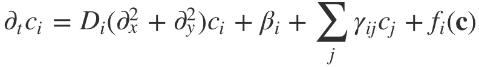

# Reaction-Diffusion Solver

[](https://travis-ci.org/justinbois/rdsolver)

## Status
**Pre-alpha. Unit tests are passing, but coverage is not complete nor are integration tests.**

## Purpose
This package solves a simple problem: reaction diffusion dynamics in two dimensions. Specifically, it solves the system of PDEs



Here, each chemical species is indicated by the subscript *i* and the physical parameters *D<sub>i</sub>*, *β<sub>i</sub>*, and *γ<sub>ij</sub>* are constants in space and time. Note that summation over like indices in the above equation is not assumed; only the explicit summation is performed. The coordinates are Cartesian and the boundary conditions periodic.

## Installation

To install, you can use pip.

```
pip install rdsolver
```

For some of the interactive visualizations to work properly in Jupyter notebooks, you may need to use version 2.0.0 of `widgetsnbextension` because of [this issue](https://github.com/jupyter-widgets/ipywidgets/issues/1678). To install this using the `conda` package manager, you will need to do:

```
conda install widgetsnbextension=2.0.0
```

You may also need to run this at the command line after installation:

```
jupyter nbextension enable --py --sys-prefix widgetsnbextension
```

Finally, your browser may have problems rending the graphics, so you should launch your Jupyter notebook like this:

```
jupyter notebook --NotebookApp.iopub_data_rate_limit=10000000
```


## Method
To solve the PDEs, I use spectral differentiation with variable time step implicit/explicit (VSIMEX) time stepping using a Crank-Nicholson/Adams-Bashforth method. The cons of this approach appear below, and the pros are best understood by considering why these methods are chosen.

#### Why IMEX?

Reaction-diffusion equations can be stiff, which makes explicit time stepping really slow. So, if we can do implicit stepping, we can take much larger steps because implicit methods have a more amenable stability region. The problem is that nonlinear problems make implicit time stepping difficult because we would have to solve a system of nonlinear equations to make time steps. A typical way around this is to linearize the equations and take steps according to the linearized model.

Instead, imagine that the right hand side of the PDEs have a linear stiff part and a nonlinear part that is not so stiff. We could then do implicit time stepping on the linear part (which involves solving a *linear* system of equations) and explicit time stepping on the nonlinear part. This is typically what we have in reaction-diffusion equations. The diffusive part is stiff, and the chemical reaction part is not. In the system of equations solved here, we have split out the linear parts given by the diffusion terms and the spontaneous production and degradation terms that are common in biological application from the remainder of the nonlinear reaction terms, given by the function *f<sub>i</sub>*(*c*<sub>1</sub>, *c*<sub>2</sub>, ...).

So, for each time step, we step implicitly for the linear terms using a Crank-Nicholson step and explicitly for the nonlinear terms using an Adams-Bashforth step.


#### Why variable step size?

By taking steps of variable size, we can take bigger steps when the solution is not changing much, and shorter steps when it is, allowing us to resolve the dynamics without wasting steps. I use a PID controller to adjust step size to hit a (small) target relative change in the solution for each step.

The primary reference for the VSIMEX method is Wang and Ruuth, *J. Comput. Math.*, **26**, 838-855, 2008.


#### Why spectral methods?
There are two major bonuses to using spectral methods. First, the solution of the linear system in the implicit time step becomes trivial. This makes the time stepping **much** more efficient. Second, spectral methods give very accurate derivatives with fewer grid points. In turn, the fewer grid points results in faster time stepping.

We can do non-periodic boundary conditions with spectral methods by computing on Chebyshev grids, which is a future enhancement. For now, we limit the solutions to periodic domains.

#### Cons to spectral methods

There are a few important watch-outs when using spectral methods. First, the initial conditions need to be chosen carefully. Importantly, you cannot just make random perturbations. The functions must be strictly periodic and smooth. Along the same lines, spectral methods will fail if there are very sharp changes in the concentration profile.
